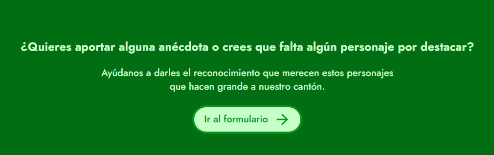

# Ecos de la Pampa

**Ecos de la Pampa** es una plataforma digital que busca preservar la memoria viva de Santa Cruz, Guanacaste. Un museo web donde las voces, las anécdotas y los rostros de la bajura encuentran un espacio para trascender el tiempo.

---

## 🎯 Propósito

Crear un archivo cultural y afectivo de los personajes, saberes y tradiciones populares de Santa Cruz, con la participación activa de la comunidad.

A través de esta iniciativa, se promueve:

- 📜 La conservación de historias de vida y expresiones culturales.
- 👀 La visibilización de saberes tradicionales y oficios locales.
- 🗣️ La participación de la comunidad en la construcción de su propia memoria colectiva.

---

## 🧰 Tecnologías utilizadas

- **Frontend:** Astro + Tailwind CSS + TypeScript
- **Formulario colaborativo:** Google Forms 
- **Almacenamiento de datos:** JSON 

---

## 🖼️ Características principales

- Biografías detalladas de personajes locales
- Galería fotográfica y visuales tradicionales
- Formulario para aportar anécdotas, datos o fotografías
- Diseño accesible, simple y adaptable a móviles

---

## 🗺️ Contexto

El nombre **Ecos de la Pampa** hace referencia al susurro de la sabana, al eco que dejan las historias contadas al calor de la bajura, a los rostros anónimos que dan forma a una identidad viva y profunda.

Este proyecto nace del amor por la tierra, la palabra y la gente. No busca documentar únicamente hechos, sino también sentimientos, emociones, y formas de vivir que definen a Santa Cruz y a su gente.

---

## 🙌 Cómo contribuir

¿Conoces una historia, un personaje o una tradición que no debe olvidarse?

1. Ingresa al sitio
2. Da click al boton "Ir al formulario"

3. Adjunta tu texto, fotografía o anécdota

También puedes contribuir al desarrollo del sitio a través de pull requests o sugerencias.

---

## 💬 Agradecimiento

Gracias a todas las personas que cuidan la memoria oral de sus comunidades.  
Gracias por compartir y por recordar.

---

## 📜 Licencia

MIT – Este proyecto es de uso libre para fines educativos y culturales.  
Si vas a reutilizar o compartir contenido, por favor, cita la fuente y honra el espíritu del proyecto.

---

> *“Santa Cruz no olvida"*
